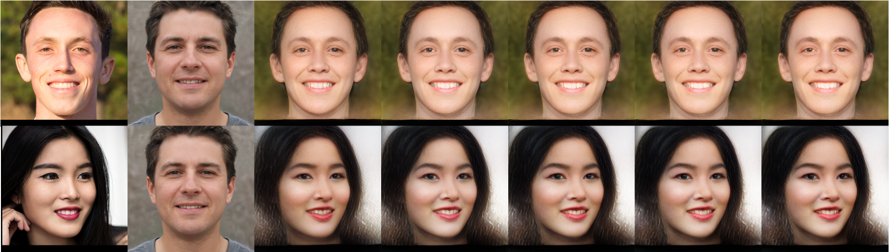
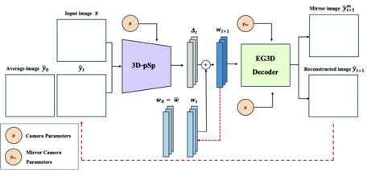

# 3DpSp: 3D-Aware pSp-based EG3D Encoder with ReStyle

<p align="center"></p>

**3DpSp** inverts a single input image into the latent space of EG3D networks.  
We use the state-of-the-art 3D-aware GAN network EG3D. Based on pixel2style2pixel (pSp), an encoder-based inversion of StyleGAN, we modified it for EG3D and applied ReStyle's iterative refinement methods to achieve high-quality results. Inspired by TriPlaneNet, we use mirrored images and confidence map to robustly learn 3D priors.

<p align="center"></p>

The above image illustrates our network's architecture. Starting with an input image and a synthesized image generated from the mean latent vector in the W+ space of EG3D, the two images are concatenated and passed into the 3D-pSp encoder along with the camera parameters. Since EG3D's mapping network utilizes camera parameters to project into the W+ space, we leverage these parameters in the encoder network to robustly learn 3D prior information. Additionally, we introduce a 1x1 convolutional layer in the map2style network to enhance its expressiveness. Finally, the 3D-pSp encoder computes the residual between the two input images and adds it to the original latent vector to refine the inverted latent vector. Repeating this process iteratively enables our network to achieve finer details compared to the original pSp network.

In experiments using CelebA, our model preserves the identity of faces and conserves fine details better than pSp and e4e. 

| Model         | FID (↓)    | LPIPS (↓) | ID (↑)   |
|---------------|------------|-----------|----------|
| pSp           | 146.37     | 0.35      | 0.12     |
| e4e           | **143.92** | 0.72      | 0.07     |
| 3D-pSp (Ours) | 154.57     | **0.32**  | **0.41** |

**Notes**:
- **FID (Frechet Inception Distance)**: Lower values indicate better image fidelity and realism.
- **LPIPS (Learned Perceptual Image Patch Similarity)**: Lower values indicate better perceptual similarity to the original image.
- **ID (Identity Similarity)**: Higher values indicate better preservation of facial identity.
---

## Requirements
- **Operating System**: Linux (Tested on Ubuntu 20.04 LTS)
- **GPU**: High-end Nvidia GPU (Tested on a single Nvidia A100 GPU)
- **Environment**:
  - 64-bit Python 3.9
  - PyTorch 1.11.0
  - CUDA Toolkit 11.3
- **Dependencies**: See `requirements.txt` for additional library dependencies. This includes libraries required for `Deep3DFaceRecon_pytorch` and `unsup3d` for preprocessing.

---

## Get Started
We recommend using Miniconda to set up the virtual environment. You can use the `install_deps.sh` script to set up the environment.

```bash
chmod +x install_deps.sh
./install_deps.sh
conda activate 3DpSp
```

---

## Pretrained Models

The following pretrained models are required:

1. **EG3D Networks**: `/pretrained_models/ffhq512-128.pkl` or `/pretrained_models/ffhqrebalanced512-128.pkl`  
   Download from: [EG3D on NVIDIA NGC](https://catalog.ngc.nvidia.com/orgs/nvidia/teams/research/models/eg3d)

2. **ArcFace Networks**: `/pretrained_models/model_ir_se50.pth` (used for calculating ID Loss)  
   Download from: [InsightFace PyTorch](https://github.com/TreB1eN/InsightFace_Pytorch/blob/master/README.md)

3. **Basel Face Model (BFM09)**: `/dataset_preprocessing/ffhq/Deep3DFaceRecon_pytorch/BFM/01_MorphableModel.mat`, `/dataset_preprocessing/ffhq/Deep3DFaceRecon_pytorch/BFM/Exp_Pca.bin`  
Download from: [Basel Face Model](https://faces.dmi.unibas.ch/bfm/main.php?nav=1-0&id=basel_face_model)

4. **Deep3DFace Pytorch**: `/dataset_preprocessing/ffhq/Deep3DFaceRecon_pytorch/checkpoints/pretrained/epoch_20.pth`  
   Download from: [Deep3DFaceRecon PyTorch](https://github.com/sicxu/Deep3DFaceRecon_pytorch)

5. **Unsup3d**: `/dataset_preprocessing/ffhq/unsup3d/pretrained/pretrained_celeba/checkpoint030.pth`  
   Download from: [unsup3d](https://github.com/elliottwu/unsup3d)

6. **3DpSp (Ours)**: `/pretrained_models/3DpSp.pt`  
   Download from: [3DpSp Pretrained Model](https://www.dropbox.com/scl/fi/3c49pd5oxi5ln755l11i5/3DpSp.pt?rlkey=bv6b6o3inn9hwgag66paq80rp&st=uy0ck8gw&dl=0)

---

## Preprocessing

For training, you need camera parameters, cropped-aligned images, mirrored images, and confidence maps. Run:
```bash
cd dataset_preprocessing/ffhq
python preprocessing_in_the_wild.py --indir=/path/to/image_folder --mirror --conf_map
```

For inference, only camera parameters, cropped-aligned images, and confidence maps are required. Run:
```bash
cd dataset_preprocessing/ffhq
python preprocessing_in_the_wild.py --indir=/path/to/image_folder --conf_map
```

---

## Training

Train the model using `inversion/scripts/train.py`:

```bash
python inversion/scripts/train.py \
  --exp_dir=/path/to/exp_output \
  --train_dataset_path=/path/to/train_dataset \
  --test_dataset_path=/path/to/test_dataset
```

### Training Options
Key options can be set in `inversion/options/train_options.py`:
1. **Loss Weights**:
   - `--id_lambda`, `--lpips_lambda`, `--l2_lambda`: Weights for ID, LPIPS, and L2 losses.
   - `--id_lambda_mirror`, `--lpips_lambda_mirror`, `--l2_lambda_mirror`: Weights for mirrored loss components.

2. **ReStyle Iterative Refinements**:
   - `--n_iters_per_batch`: Number of refinement steps per batch. Default is `5`.

3. **Learning Parameters**:
   - `--batch_size`: Batch size. Default is `4`.
   - `--learning_rate`: Learning rate. Default is `0.0001`.

4. **Checkpoints**:
   - Use `--checkpoint_path` to resume training from a checkpoint.

---

## Inference

Run inference using `inversion/scripts/inference.py`:

```bash
python inversion/scripts/inference.py \
  --exp_dir=/path/to/exp_output \
  --checkpoint_path=/path/to/checkpoint \
  --data_path=/path/to/image_folder
```

---

## Acknowledgements
This project was highly inspired by and builds upon the following outstanding open-source projects:

- [EG3D](https://github.com/NVlabs/eg3d)
- [pSp](https://github.com/eladrich/pixel2style2pixel)
- [ReStyle](https://github.com/yuval-alaluf/restyle-encoder)
- [TriPlaneNet](https://github.com/anantarb/triplanenet)


